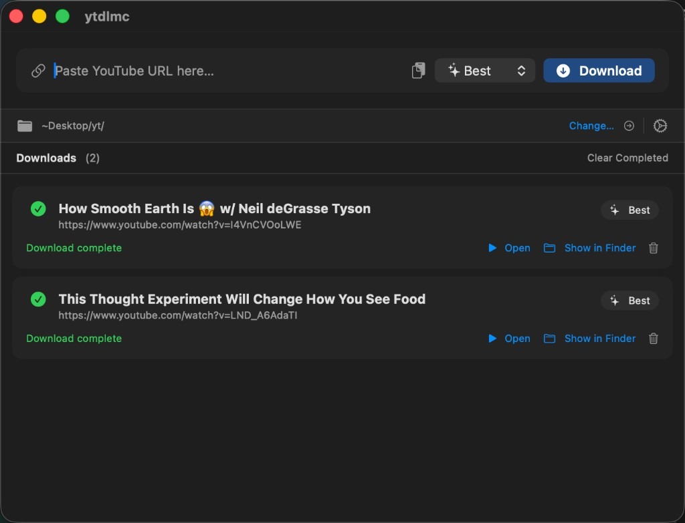
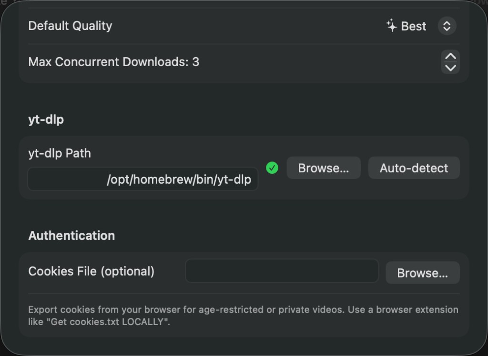

# 🎬 yt-dlp-mac

A lightweight native macOS app for downloading YouTube videos, powered by [yt-dlp](https://github.com/yt-dlp/yt-dlp).
No terminal needed — just paste a URL and click Download.

[](https://github.com/lisenhuang/yt-dlp-mac/actions/workflows/build.yml)



## ✨ Features

- 🔗 **One-click download** — paste a YouTube URL, pick quality, hit Download
- ⚡ **Multiple simultaneous downloads** — configurable concurrency (up to 10)
- 🎚️ **Quality selection** — Best, 1080p, 720p, 480p, or Audio Only
- 📊 **Live progress** — real-time progress bar, speed, and ETA for each download
- 📁 **Choose download folder** — save videos wherever you want
- 🖱️ **Drag & drop** — drop YouTube links directly onto the window
- 📋 **Smart paste** — auto-extracts YouTube URLs from clipboard text
- ⌨️ **Keyboard shortcuts** — `Cmd+Return` to download, `Cmd+D` to download from clipboard
- 🔔 **macOS notifications** — get notified when downloads finish
- 📂 **Open / Reveal** — open completed files or show them in Finder
- 🍪 **Cookies support** — use a cookies file for age-restricted or private videos
- 🔄 **Auto-install yt-dlp** — downloads yt-dlp automatically on first launch, with one-click updates in Settings

## 📥 Download

> [**⬇️ Download yt-dlp-mac.dmg**](https://github.com/lisenhuang/yt-dlp-mac/releases/latest/download/yt-dlp-mac.dmg) — latest build, ready to use

## 📋 Requirements

- macOS 15.0 or later
- **No other dependencies** — yt-dlp is automatically downloaded on first launch

## 🚀 Getting Started

```
 ┌──────────────────────────────────────────────────────┐
 │  1. Download yt-dlp-mac.dmg                          │
 │  2. Open DMG → drag yt-dlp-mac.app to Applications   │
 │  3. Right-click → Open (first launch only)           │
 │  4. Paste a YouTube URL → click Download!            │
 └──────────────────────────────────────────────────────┘
```

1. **Download** [`yt-dlp-mac.dmg`](https://github.com/lisenhuang/yt-dlp-mac/releases/latest/download/yt-dlp-mac.dmg) or grab it from [Releases](https://github.com/lisenhuang/yt-dlp-mac/releases)
2. **Open** the DMG and drag `yt-dlp-mac.app` to your Applications folder
3. **First launch** — right-click the app → Open (required once for unsigned builds)
4. The app automatically downloads yt-dlp on first launch — no manual installation needed

## 🎯 Usage

```
  Copy URL ──→ Paste ──→ Choose Quality ──→ Download!
     🔗          📋         🎚️ Best           ⬇️
                            🎚️ 1080p
                            🎚️ 720p
                            🎚️ 480p
                            🎵 Audio Only
```

1. **Copy** a YouTube video URL from your browser
2. **Paste** it into the URL field (or click the clipboard button to auto-paste)
3. **Choose quality** from the dropdown
4. **Click Download** — the video appears in the download list with live progress
5. Once complete, click **Open** to play or **Show in Finder** to locate the file

You can queue up multiple videos — they download concurrently based on your max concurrent setting.

## ⚙️ Settings

Open Settings via the gear icon or `Cmd+,`.



| Setting | Description |
|---|---|
| 📁 **Download Folder** | Where videos are saved |
| 🎚️ **Default Quality** | Quality preset for new downloads |
| ⚡ **Max Concurrent Downloads** | How many videos download at once (1–10) |
| 🔧 **yt-dlp** | Auto-installed; shows version with one-click Update button |
| 🍪 **Cookies File** | Optional `cookies.txt` for age-restricted or private videos |

### 🍪 Cookies

Some videos require authentication. To use cookies:

1. Install a browser extension like [Get cookies.txt LOCALLY](https://chromewebstore.google.com/detail/get-cookiestxt-locally/cclelndahbckbenkjhflpdbgdldlbecc)
2. Export cookies from YouTube as a `.txt` file
3. Set the path in Settings → Cookies File

## 🛠️ Building from Source

```bash
git clone https://github.com/lisenhuang/yt-dlp-mac.git
cd yt-dlp-mac
open ytdlmc.xcodeproj
```

Then hit `Cmd+R` in Xcode to build and run.

## 🤔 Why macOS Only? (Why Not iOS?)

Building this for iOS would be significantly harder due to platform restrictions:

```
                    macOS                          iOS
            ┌─────────────────┐          ┌─────────────────────┐
  yt-dlp    │ ✅ Run directly  │          │ ❌ Can't run Python  │
            │    via Process   │          │    or shell commands │
            ├─────────────────┤          ├─────────────────────┤
  Cookies   │ ✅ Export from   │          │ ❌ Apps are sandboxed│
            │    browser easily│          │    Can't read Safari │
            ├─────────────────┤          ├─────────────────────┤
  Files     │ ✅ Full file     │          │ ❌ Sandboxed storage │
            │    system access │          │    only              │
            ├─────────────────┤          ├─────────────────────┤
  Distribute│ ✅ Direct .dmg   │          │ ❌ App Store rejects │
            │    download      │          │    downloader apps   │
            └─────────────────┘          └─────────────────────┘
```

**The three main blockers:**

| # | Problem | Why it's hard on iOS |
|---|---|---|
| 1 | 🐍 **No yt-dlp** | yt-dlp is Python-based. iOS can't execute external binaries or scripts. You'd have to reimplement YouTube's extraction logic in Swift — and YouTube changes it constantly. |
| 2 | 🍪 **No cookies** | Each iOS app is sandboxed. Safari's cookies are invisible to other apps. There's no "export cookies" extension on mobile. The only workaround is an in-app WebView login, which Google may flag. |
| 3 | 🚫 **No App Store** | Apple rejects YouTube downloaders. You'd need to sideload via AltStore or a personal dev certificate (expires every 7 days on free accounts). |

A more practical iOS approach would be a **companion app** that remotely controls this macOS app over your local network — keeping yt-dlp and cookies on the Mac where they work natively.

## 📄 License

MIT
